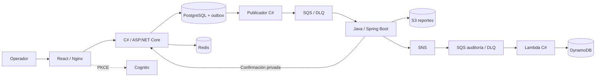

# Cloud Dispatch

[](https://github.com/jorgefprietol/cloud-dispatch-platform/actions/workflows/ci.yml)

Plataforma de operaciones para registrar pedidos, coordinar su despacho asíncrono y conservar trazabilidad. Combina una API en C#, procesamiento en Java y una consola React, con contenedores y una arquitectura AWS reproducible.

## Capacidades

- Registro validado de pedidos e idempotencia por usuario y solicitud.
- Escritura atómica del pedido y su evento mediante outbox en PostgreSQL.
- Consumo de SQS en Java, reintentos y cola de mensajes fallidos.
- Reportes JSON en S3 con tracking determinista y confirmación idempotente.
- Consola adaptable con búsqueda, filtros, indicadores y descarga de reportes.
- Cognito con Authorization Code + PKCE, JWT y separación de datos por identidad.
- Caché Redis con fallback a PostgreSQL.
- Auditoría serverless en C#: SNS → SQS → Lambda → DynamoDB, con fallos parciales por lote.
- CI con pruebas de dominio, infraestructura, integración y navegador; imágenes versionadas por commit, SBOM y procedencia.

## Arquitectura



La ejecución local usa PostgreSQL, Redis y LocalStack para SQS/S3. La rama de auditoría serverless se define para AWS y se verifica con pruebas del handler; Docker Compose no ejecuta Lambda. La infraestructura cloud no se despliega al clonar el repositorio.

## Ejecutar localmente

Requisitos: Docker con Compose y Node.js 22 para las verificaciones. Para compilar fuera de Docker: .NET 10 y JDK 21 / Maven 3.9.

```powershell
Copy-Item .env.example .env
docker compose up -d --build
node scripts/smoke.mjs
node scripts/seed.mjs
```

En Linux/macOS, usar `cp .env.example .env`. Abrir **http://localhost:18140**. El puerto puede cambiarse con `WEB_PORT` en `.env`; `DOCKER_SUBNET` permite elegir una subred libre si otra red local ya utiliza la predeterminada. Los servicios de datos y la API no publican puertos en el host. La identidad de desarrollo solo se habilita con `ASPNETCORE_ENVIRONMENT=Development` y `Auth__Demo=true`.

```sh
docker compose logs -f api worker
docker compose down
```

`down` conserva los pedidos. `down -v` elimina los datos locales. No cargar datos personales reales en el entorno de desarrollo.

## Verificaciones

```sh
dotnet test tests/Orders.Tests/Orders.Tests.csproj -c Release
mvn -B -f services/dispatch-worker/pom.xml verify
cd apps/console
npm ci
npm run build
npx playwright install chromium
npm run test:e2e
```

Desde `infra/`: `npm ci`, `npm run build`, `npm test` y `npm run synth`. La prueba de humo verifica creación, reintento idempotente, conflicto de payload, validación, bloqueo de rutas internas, despacho Java, reporte S3 e indicadores. Las pruebas del navegador cubren el flujo de operación y el tamaño móvil.

## Entrega y AWS

GitHub Actions valida cada cambio. Después de una ejecución exitosa en `main`, publica las cuatro imágenes en GHCR con `sha-<commit>`. Las tres imágenes ECS incluyen SBOM y procedencia; la imagen Lambda usa un manifest simple sin attestations para mantener compatibilidad con su runtime. El workflow **Deploy AWS** se activa manualmente, comprueba que el commit tenga CI exitoso y usa OIDC para copiar las imágenes a ECR y desplegar CDK.

AWS requiere cuenta, región, dominio, certificado ACM y las variables documentadas en [Preparación AWS](docs/aws-setup.md). El stack propone ECS Fargate en dos zonas, ALB HTTPS, RDS Multi-AZ, ElastiCache con TLS, KMS, Secrets Manager, SQS/SNS, S3, Cognito, Lambda/DynamoDB, WAF, Route 53, CloudWatch, CloudTrail y AWS Backup. No contiene claves cloud ni valores de cuenta reales.

## Estructura

| Ruta | Responsabilidad |
|---|---|
| `services/orders-api` | API, persistencia, seguridad, caché y outbox en C# |
| `services/dispatch-worker` | Consumo de eventos y despacho en Java |
| `services/audit-function` | Auditoría serverless en C# |
| `apps/console` | Consola React / TypeScript |
| `infra` | AWS CDK y verificaciones de seguridad |
| `scripts` | Inicialización y prueba de integración |
| `.github/workflows` | CI, imágenes y despliegue AWS |

## Decisiones y operación

- [Diseño y decisiones](docs/architecture.md)
- [Cobertura de capacidades AWS](docs/aws-capabilities.md)
- [Preparación y despliegue AWS](docs/aws-setup.md)
- [Operación, fallos y recuperación](docs/operations.md)
- [Descripción profesional del proyecto](docs/experience.md)
- [Política de seguridad](SECURITY.md)

El sistema entrega eventos al menos una vez. La idempotencia protege el pedido y el reporte; las notificaciones SNS pueden repetirse. Los indicadores pueden retrasarse hasta 10 segundos. Las garantías de disponibilidad, rendimiento y recuperación deben medirse en la cuenta de destino antes de establecer compromisos operativos.

Licencia MIT.
